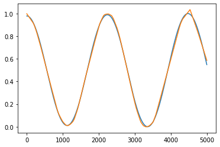

# DNN Pendulum
## REF
Choi, HS., An, J., Han, S. et al. Data-driven simulation for general-purpose multibody dynamics using Deep Neural Networks. Multibody Syst Dyn 51, 419–454 (2021). https://doi.org/10.1007/s11044-020-09772-8
## Introduction
对参考文献提出的神经网络拟合多体的复现
## Input
>时间-0~5s,0.001s  
>质量-1~2kg,0.1kg  
>长度-1~2m,0.1m  

## Output
>角度  

## Note
经典的学习过程，若在学习前不清理上一次学习的结果，会导致“好”的结果和奇怪的现象。考虑到所生成的训练集排布，进行了随机重排，尽管不知道效果
## Hyper Parameters
| 种类 | 参数 | 备注 |
|:--------|:---------:|--------:|
|层|256x256x256||
|batch|512||
|学习率|0.001||
|epochs|500||
|loss|MSE||
|激活|ReLU||
|train,test|:-100000||
## Results
从正常排序的数据中选取一组，
>R2 0.9983860562819763  
>RMSE 0.01400939  
>MAE 0.011531768  
>CV 0.026281068  

