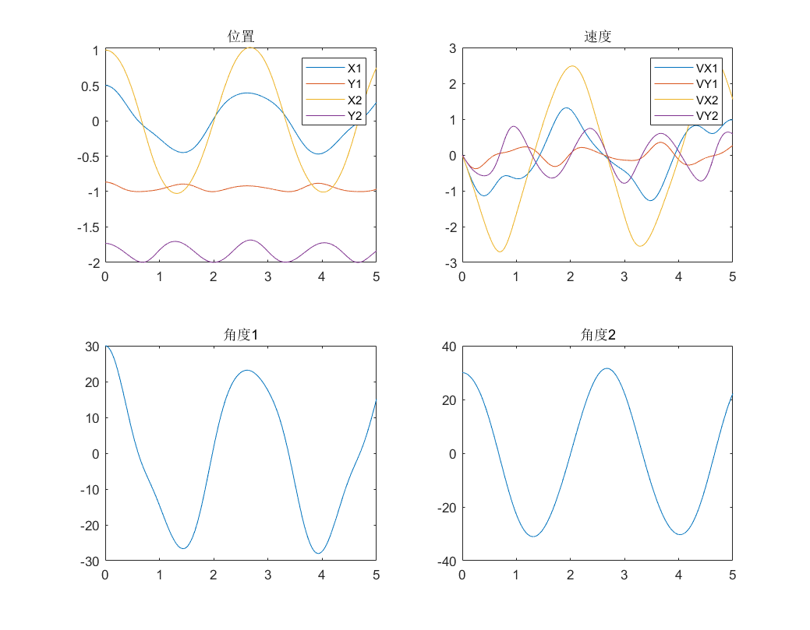
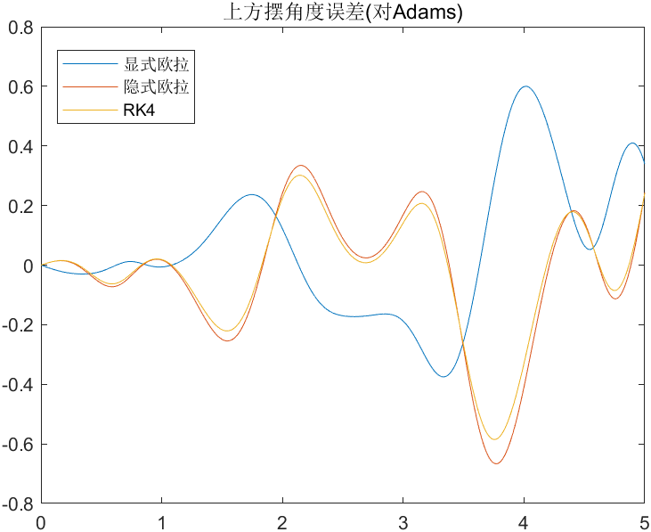

# 双摆
## 说明
`DoublePendulumBaumgrate.m`为双摆的DAE解法
## 模型
- 小球1重量$m_1=1$，摆长$l_1=1$  
- 小球2重量$m_2=1$，摆长$l_2=1$  
## DAE
列出微分代数方程
$M\ddot{q}+\Phi^T_q\lambda=B$  
$\Phi=\begin{bmatrix}
    x_1^2+y_1^2-l_1^2\\
    (x_2-x_1)^2+(y_2-y_1)^2-l_2^2
\end{bmatrix}$  
其中，$M$为质量矩阵，$\Phi_q$为$\Phi$的雅可比矩阵，$\lambda$为约束反力，$B$为外力  
$M=\begin{bmatrix}
    m_1\\
    0&m_1\\
    0&0&m_2\\
    0&0&0&m_2
\end{bmatrix}$  
$B=\begin{bmatrix}
    0&m_1g&0&m_2g
\end{bmatrix}^T$  
matlab代码为：  
```matlab
for i=1:(length(t)-1)
    P=2*[v(1,i) v(2,i) 0 0;v(1,i)-v(3,i) -v(1,i)+v(3,i) v(2,i)-v(4,i) -v(2,i)+v(4,i)]*v(:,i);
    phi=[q(1,i)*q(1,i)+q(2,i)*q(2,i)-1;(q(1,i)-q(3,i))^2+(q(2,i)-q(4,i))^2-1];%约束
    phiq=[2*q(1,i) 2*q(2,i) 0 0;2*(q(1,i)-q(3,i)) 2*(q(2,i)-q(4,i)) -2*(q(1,i)-q(3,i)) -2*(q(2,i)-q(4,i))];%笛卡尔
    phiT=phiq*v(:,i);
    P1=P-2*alpha*phiT-(beta^2)*phi;
    LEFT=[A phiq';phiq zeros(2,2)];
    RIGHT=[B;P1];
    X=(LEFT^-1)*RIGHT;
    a(1,i)=X(1);a(2,i)=X(2);a(3,i)=X(3);a(4,i)=X(4);
    v(:,i+1)=v(:,i)+h*a(:,i);
    q(:,i+1)=q(:,i)+h*v(:,i);
    
    for j=1:15
        
        P=2*[v(1,i+1) v(2,i+1) 0 0;
                v(1,i+1)-v(3,i+1) -v(1,i+1)+v(3,i+1) v(2,i+1)-v(4,i+1) -v(2,i+1)+v(4,i+1)]*v(:,i+1);
        phi=[q(1,i+1)*q(1,i+1)+q(2,i+1)*q(2,i+1)-1;
                 (q(1,i+1)-q(3,i+1))^2+(q(2,i+1)-q(4,i+1))^2-1];%约束
        phiq=[2*q(1,i+1) 2*q(2,i+1) 0 0;
                   2*(q(1,i+1)-q(3,i+1)) 2*(q(2,i+1)-q(4,i+1)) -2*(q(1,i+1)-q(3,i+1)) -2*(q(2,i+1)-q(4,i+1))];%笛卡尔
        phiT=phiq*v(:,i+1);
        
        P1=P-2*alpha*phiT-(beta^2)*phi;
        LEFT=[A phiq';phiq zeros(2,2)];
        RIGHT=[B;P1];
        X=(LEFT^-1)*RIGHT;
        a(1,i+1)=X(1);a(2,i+1)=X(2);a(3,i+1)=X(3);a(4,i+1)=X(4);
        v(:,i+1)=v(:,i)+h*a(:,i+1);
        q(:,i+1)=q(:,i)+h*v(:,i+1);
        
    end
end
```
结果为：  

<center>双摆结果</center>  

与Adams对比，误差为：  

<center>双摆误差</center>  