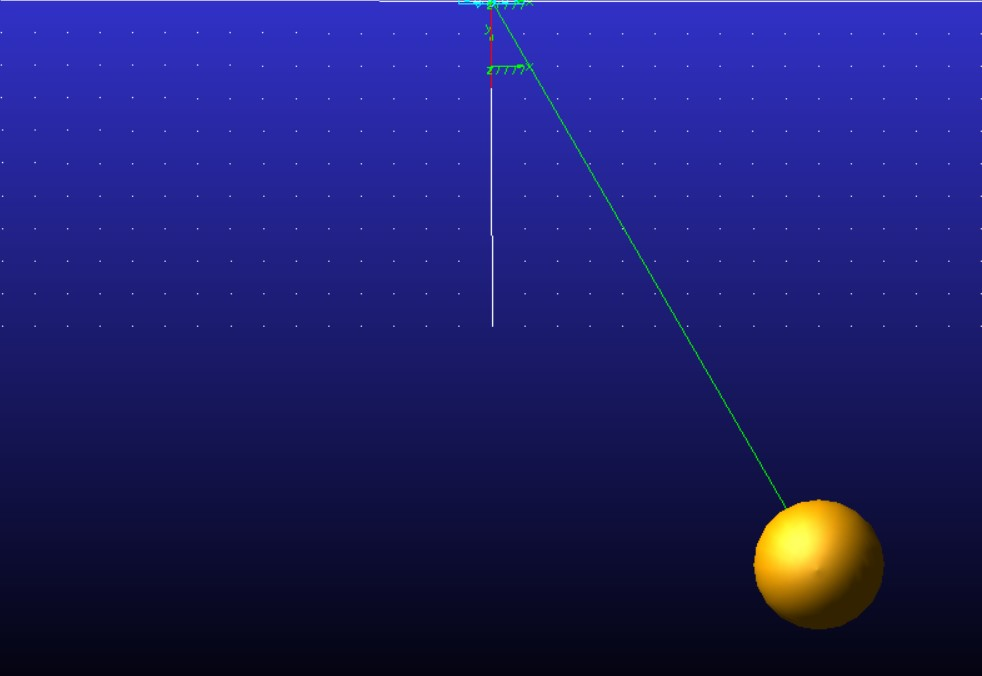
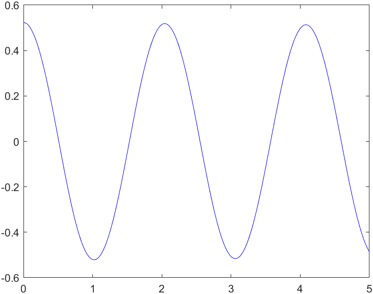
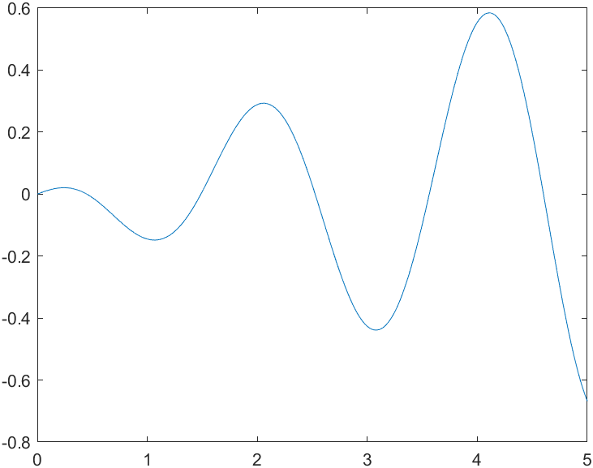
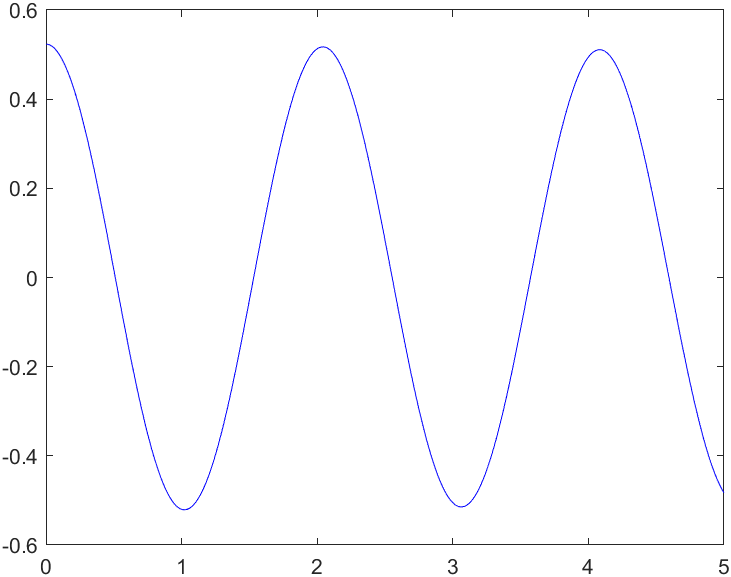
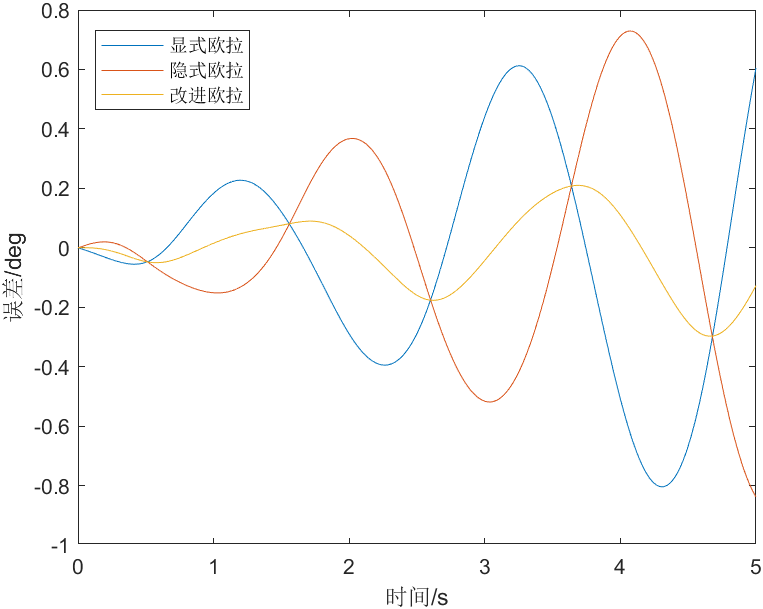

# 单摆（ODE与DAE）
## 说明
`PendulumODE.m`是单摆的ODE解法
`PendulumBaumgrate3`是单摆的DAE解法
## 模型


## ODE
采用拉格朗日方程建模，有：  

解得：  


### 求解
设定初始值：
```matlab
dy = zeros(2, 1);
h = 0.001;
t = 0:h:5; n = length(t);
global u v a y0
u = pi / 6; v = 0; a = -9.8 * sin(u) + 0;%位置、速度、加速度
```
将方程列为隐式欧拉形式：
$a_{k+1}=-{g}/{l}*sin(\theta_{k+1})$  
$v_{k+1}=v_{k}+\Delta t*a_{k+1}$  
$\theta_{k+1}=\theta_{k}+\Delta t*v_{k+1}$  
对应以下matlab代码：
```matlab
function F = PendulumImplicit(y)
    %隐式表达
    %F为0
    %y为k+1组
    global y0%为第k组
    h = 0.001;%步长
    g = 9.8;
    F(1) = y(3) - (-g * sin(y(1))); %加速度
    F(2) = y(2) - (y0(2) + h * y(3)); %速度
    F(3) = y(1) - (y0(1) + h * y(2)); %位置
end
```
调用`fsolve`求解：
```matlab
for i = 2:n
    y0 = [u(i - 1) v(i - 1) a(i - 1)]; %fsolve寻找零点的初始位置
    f = fsolve(@PendulumImplicit, y0);
    u(i) = f(1);
    v(i) = f(2);
    a(i) = f(3);
end
```
`fsolve`在求解时速度较慢，使用迭代形式的隐式欧拉法：
```matlab
%% 隐式欧拉
for i = 2:n
    a(i) = -9.8 * sin(u(i - 1));
    v(i) = v(i - 1) + h * a(i);
    u(i) = u(i - 1) + h * v(i);

    for j = 1:10
        a(i) = -9.8 * sin(u(i));
        v(i) = v(i - 1) + h * a(i);
        u(i) = u(i - 1) + h * v(i);
    end

end
```
结果为：  
  
以`Adams`为基准，计算`fsolve`的误差：
  
可以看出，误差量级较小，但在周期性增大。


## DAE
分别列出微分方程与代数方程： 

$M\ddot{q}+\Phi^T_q\lambda=B$  
$\Phi=\begin{bmatrix}
    x-lsin\theta\\
    y+lcos\theta
\end{bmatrix}$

$B=\begin{bmatrix}
    0\\-mg\\-mglsin\theta
\end{bmatrix}$
>其中:
>$\lambda$为拉格朗日乘子
>$\Phi$为约束方程，实际上，约束方程可以有多种形式，以上仅为其中一种


联立以上方程，有：

此即为增广矩阵.
>其中：  
> $\Phi_q$ 为 $\Phi$ 对于 $q$ 的雅可比矩阵  
> $B$为外力  
> $\xi$为加速度  

实际上，以上方程只满足了加速度的约束，位置和速度的约束并不能完全满足，随着计算过程的进行，位置和速度与实际情况之间的偏差会积累并导致结果发散，此为约束不稳定。  
针对以上问题，有多种方法，其中之一是Baumgrate提出的约束违约稳定法。  
通过在$\xi$项中加入$-(2\alpha\dot{\Phi}+\beta^2\Phi)$，实现对位置和速度约束违约时的修正。  
matlab代码为：
```matlab
for i = 1:(length(t) - 1)
    B(3, 1) = -9.8 * sin(q(3, i));
    P(1) = -v(3, i) ^ 2 * cos(q(3, i)); P(2) = v(3, i) ^ 2 * sin(q(3, i)); %加速度约束
    phi = [q(1, i) - sin(q(3, i)); q(2, i) + cos(q(3, i))];
    phiq = [1 0 -cos(q(3, i)); 0 1 -sin(q(3, i))];
    phiT = phiq * v(:, i);
    P1 = P - 2 * alpha * phiT - (beta ^ 2) * phi;
    LEFT = [A phiq'; phiq zeros(2)];
    RIGHT = [B; P1];
    X = (LEFT ^ -1) * RIGHT;
    a(1, i) = X(1); a(2, i) = X(2); a(3, i) = X(3);
    v(:, i + 1) = v(:, i) + h * a(:, i);
    q(:, i + 1) = q(:, i) + h * v(:, i);
end
```
同样的，以迭代的隐式欧拉方法给出：
```matlab
%% 隐式欧拉
for i = 1:(length(t) - 1)
    B(3, 1) = -9.8 * sin(q(3, i));
    P(1) = -v(3, i) ^ 2 * cos(q(3, i)); P(2) = v(3, i) ^ 2 * sin(q(3, i)); %加速度约束
    phi = [q(1, i) - sin(q(3, i)); q(2, i) + cos(q(3, i))];
    phiq = [1 0 -cos(q(3, i)); 0 1 -sin(q(3, i))];
    phiT = phiq * v(:, i);
    P1 = P - 2 * alpha * phiT - (beta ^ 2) * phi;
    LEFT = [A phiq'; phiq zeros(2)];
    RIGHT = [B; P1];
    X = (LEFT ^ -1) * RIGHT;
    a(1, i) = X(1); a(2, i) = X(2); a(3, i) = X(3);
    v(:, i + 1) = v(:, i) + h * a(:, i);
    q(:, i + 1) = q(:, i) + h * v(:, i);

    for j = 1:15
        B(3, 1) = -9.8 * sin(q(3, i + 1));
        P(1, 1) = -v(3, i + 1) ^ 2 * cos(q(3, i + 1)); P(2, 1) = v(3, i + 1) ^ 2 * sin(q(3, i + 1)); %加速度约束
        phi = [q(1, i + 1) - sin(q(3, i + 1)); q(2, i + 1) + cos(q(3, i))];
        phiq = [1 0 -cos(q(3, i + 1)); 0 1 -sin(q(3, i + 1))];
        phiT = phiq * v(:, i + 1);
        P1 = P - 2 * alpha * phiT - (beta ^ 2) * phi;
        LEFT = [A phiq'; phiq zeros(2)];
        RIGHT = [B; P1];
        X = (LEFT ^ -1) * RIGHT;
        a(1, i + 1) = X(1); a(2, i + 1) = X(2); a(3, i + 1) = X(3);
        v(:, i + 1) = v(:, i) + h * a(:, i + 1);
        q(:, i + 1) = q(:, i) + h * v(:, i + 1);
    end

end
```
结果为：  
  

同样地，以`Adams`为基准，计算误差：

显然，改进欧拉误差远小于隐式欧拉。