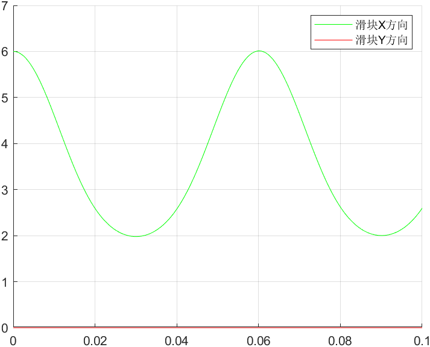
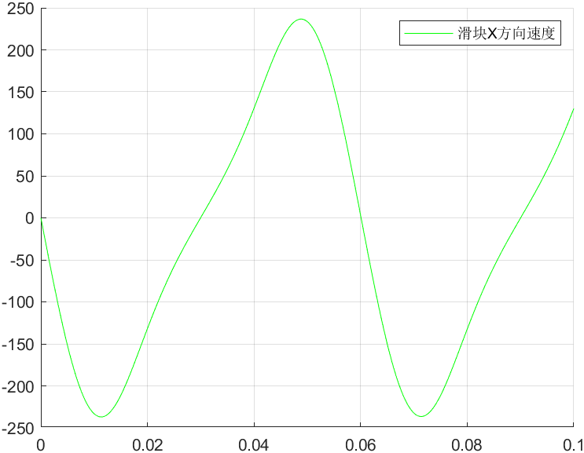
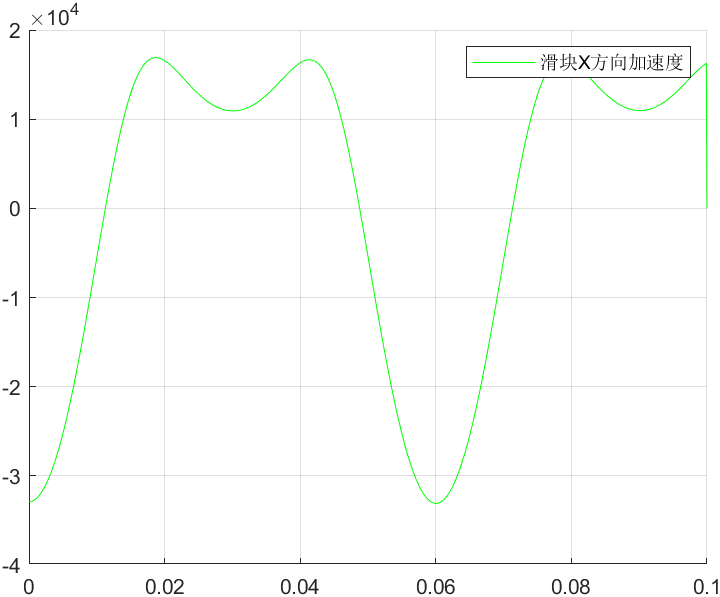

# 曲柄滑块
## 说明
`SliderCrank.m`是曲柄滑块的DAE解法
## 模型
- 曲柄转速$100\pi/3$每秒  
- 曲柄长度$2l_1=1$，质量$m_1=1$  
- 连杆长度$2l_1=2$，质量$m_2=1$  
- 滑块质量$m_3=1$  
## DAE
列出微分代数方程
$M\ddot{q}+\Phi^T_q\lambda=B$  
$\Phi_K=\begin{bmatrix}
    x_1-l_1*cos(\theta_1)\\
    y_1+l_1*sin(\theta_1)\\
    -2*l_1*cos(\theta_1)-l_2*cos(\theta_2)+x_2\\
    -2*l_1*sin(\theta_1)-l_2*sin(\theta_2)+y_2\\
    y_2+l_2*sin(\theta_2)\\
    l_2*cos(\theta_2)-x_2+x_3\\
    y_3
\end{bmatrix}$  
$\Phi_D=\begin{bmatrix}
    \theta_1-\omega*t
\end{bmatrix}$  
$\Phi=\begin{bmatrix}
    \Phi_K\\
    \Phi_D
\end{bmatrix}$  
其中，$M$为质量矩阵，$\Phi_q$为$\Phi$的雅可比矩阵，$\lambda$为约束反力，$B$为外力  
$M=\begin{bmatrix}
    m_1&&&&\\
    0&m_1\\
    0&0&J_1\\
    0&0&0&m_2&\\
    0&0&0&0&m_2\\
    0&0&0&0&0&J_2\\
    0&0&0&0&0&0&m_3\\
    0&0&0&0&0&0&0&m_3
\end{bmatrix}$  
$B=\begin{bmatrix}
    0&m_1g&0&0&m_2g&0&m_3g&0
\end{bmatrix}^T$  

matlab代码为：  
```matlab
%%
%隐式欧拉
for i = 1:length(t) - 1
    phi = [q(1, i) - l1 * cos(q(3, i));
           q(2, i) - l1 * sin(q(3, i));
           -2 * l1 * cos(q(3, i)) + q(4, i) - l2 * cos(q(6, i));
           -2 * l1 * sin(q(3, i)) + q(5, i) - l2 * sin(q(6, i));
           %-2 * l1 * sin(q(3, i)) + 2 * l2 * sin(q(6, i))
           l2 * cos(q(6, i)) + q(4, i) - q(7, i);
           q(5,i)+l2*sin(q(6,i));
           q(8, i);
           q(3,i)-w*h*(i-1)]; %约束
    phiq = [1 0 l1 * sin(q(3, i)) 0 0 0 0 0;
            0 1 -l1 * cos(q(3, i)) 0 0 0 0 0;
            0 0 2 * l1 * sin(q(3, i)) 1 0 l2 * sin(q(6, i)) 0 0;
            0 0 -2 * l1 * cos(q(3, i)) 0 1 -l2 * cos(q(6, i)) 0 0;
            %0 0 2 * l1 * cos(q(3, i)) 0 0 2 * l2 * cos(q(6, i)) 0 0;
            0 0 0 1 0 -l2 * sin(q(6, i)) -1 0;
            0 0 0 0 1 l2*cos(q(6,i)) 0 0;
            0 0 0 0 0 0 0 1
            0 0 1 0 0 0 0 0]; %雅可比
    P = [-l1 * cos(q(3, i)) * v(3, i) ^ 2;
       -l1 * sin(q(3, i)) * v(3, i) ^ 2;
       -2*l1 * cos(q(3, i)) * v(3, i) ^ 2 - l2 * cos(q(6, i)) * v(6, i) ^ 2;
       -2*l1 * sin(q(3, i)) * v(3, i) ^ 2 - l2 * sin(q(6, i)) * v(6, i) ^ 2;
        %l1 * sin(q(3, i)) * v(3, i) ^ 2 + 2 * l2 * sin(q(6, i)) * v(6, i) ^ 2;
       l2 * cos(q(6, i)) * v(6, i) ^ 2;
       l2*sin(q(6,i))*v(6,i)^2;
       0;
       0];
    phit=[0;0;0;0;0;0;0;-w];
    phiT = phiq * v(:, i)+phit;
    P1 = P - 2 * alpha * phiT - (beta ^ 2) * phi;
    LEFT = [A phiq'; phiq zeros(length(P))];
    RIGHT = [B; P1];
    X = LEFT \ RIGHT;
    a(:, i) = X(1:8);
    v(:, i + 1) = v(:, i) + h * a(:, i);
    q(:, i + 1) = q(:, i) + h * v(:, i);
end
end
```
结果为  

<center>滑块X方向位置</center>  

  
<center>滑块X方向速度</center>  

  
<center>滑块X方向加速度</center>  