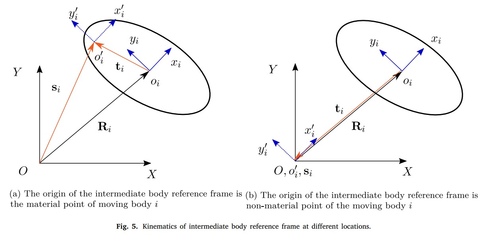
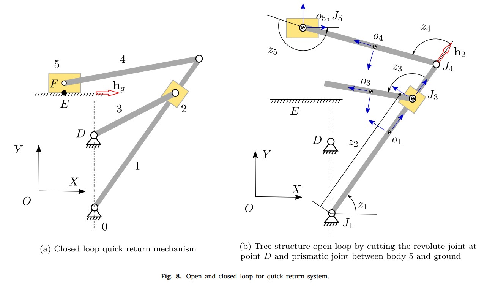

# 半递推
## 分类
根据坐标系选取分类，有两种，一个是体坐标系固接在体上，另一个则是原点与全局坐标系重合  
  
## 速度转换
### 方法I
$\dot{q}=V\dot{z}$
其中$q$是物体坐标，$z$是关节坐标  
加速度：
$\ddot{q}=V\ddot{z}+\dot{V}\dot{z}$
### 方法II
令：  
$\dot{Z_i}=\begin{bmatrix}
    \dot{s_i}\\
    \dot{\theta_i}
\end{bmatrix}$  
有：  
$\dot{q_i}=D_i\dot{Z_i}$
$\ddot{q_i}=D_i\ddot{Z_i}+e_i$
$\dot{Z_i}$和$\ddot{Z_i}$可表示为：  
$\dot{Z_i}=TR_d\dot{z}$
$\ddot{Z_i}=T(R_d\ddot{z}+d)$
其中$T$是拓扑矩阵，$R_d$是关节向量排列成的对角阵，$d$由链式求导得到  
## 动力学方程
虚功原理
$\delta q^T(M\ddot{q}+\Phi_q^T\lambda-Q_v-Q_e)=0$  
其中$Q_v$为速度二次项，$Q_e$为外力  
将$q$及其相关进行转换，即可得到相应的虚功方程
## 闭环
断开闭环形成开环  

保留被断开的约束方程，形成DAE，其对应的雅可比矩阵不会被速度转换矩阵消去
## REF
The explanation of two semi-recursive multibody methods for educational purpose
